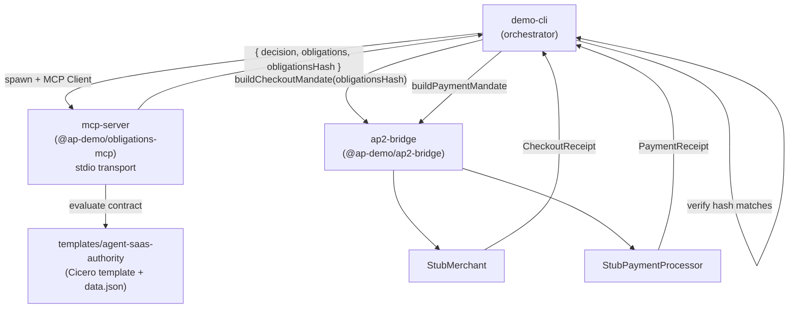

# Accord Project Phase 2 Demo

This monorepo proves the end-to-end flow: a smart legal contract evaluated by an MCP server produces a cryptographically-hashed obligations bundle that is embedded into an AP2 payment mandate, enabling downstream parties (merchant, payment processor) to verify that every payment was contract-authorised.

## Quick Start

```bash
npm install
npm run build
npm run demo
```

## Architecture



## Workspace Layout

```
phase2-demo/
  packages/
    mcp-server/        @ap-demo/obligations-mcp  — MCP stdio server (contract evaluator)
    ap2-bridge/        @ap-demo/ap2-bridge        — AP2 mandate builders + stubs
    demo-cli/          @ap-demo/demo-cli          — CLI orchestrator (this runs `npm run demo`)
  templates/
    agent-saas-authority/                          — Cicero template + sample data
  repos/AP2/                                       — AP2 spec clone (do not modify)
```

## Scenarios

The demo runs three scenarios in sequence:

| # | Scenario | Amount | Expected Decision |
|---|----------|--------|-------------------|
| 1 | GitHub Enterprise renewal | $1,800 | APPROVED |
| 2 | Figma new purchase | $3,500 | REQUIRES_HUMAN_APPROVAL |
| 3 | Databricks (over annual cap) | $40,000 | DENIED |

## Why This Matters: The Gap AP Fills

The AP2 spec defines a powerful payment mandate format, but it has no built-in mechanism for proving that a payment was authorised by a contract. Without Accord Project, an agent can construct any mandate it likes — there is no cryptographic link back to the terms the principal agreed to.

The Phase 2 prototype fills this gap:

1. **Contract evaluation at the MCP layer.** Every purchase request is evaluated by a Cicero smart legal contract (the `agent-saas-authority` template). The MCP server returns not just a decision but a structured `obligations[]` array describing the conditions of approval.

2. **Cryptographic binding.** The obligations array is canonicalised (stable key order, deterministic serialisation) and SHA-256 hashed. This `obligationsHash` is embedded in both the AP2 `CheckoutMandate` and `PaymentMandate` as `accordObligations.hash`.

3. **Verifiability.** Any party that receives the mandate can re-fetch the obligations document and verify its hash. The merchant stub and payment processor stub in this demo both **reject** mandates that lack the hash, demonstrating the enforcement point.

4. **Auditability.** Because the hash is deterministic, the obligations snapshot that authorised payment $X can be reproduced at any future audit date.

This is the mechanism described in the Phase 2 spec under "cryptographically linking AP2 mandates to a contract-evaluated obligations bundle."
