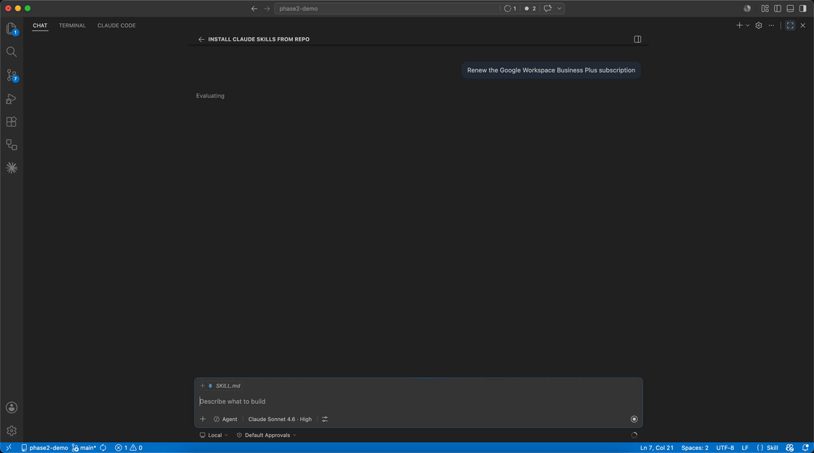
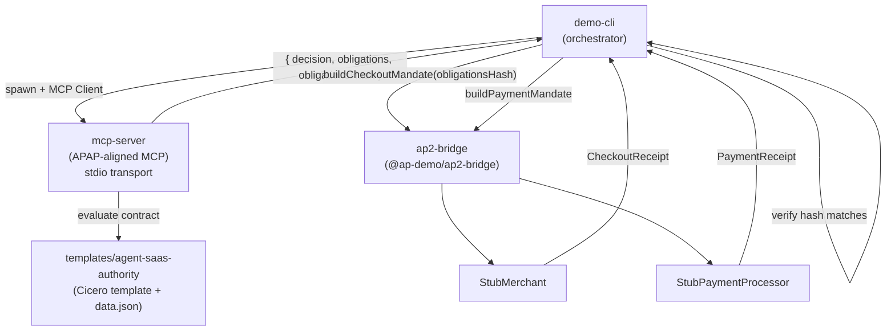

# agentic-obligations

A prototype demonstrating the [Accord Project](https://accordproject.org) as the open obligations layer for agentic commerce.




An AI agent's SaaS procurement authority is encoded as a [Cicero](https://github.com/accordproject/cicero) smart legal contract template. An [APAP](https://github.com/accordproject/apap)-aligned MCP server evaluates the contract for every purchase request and returns a structured obligations bundle. That bundle is SHA-256 hashed and embedded into an [AP2](https://github.com/google-agentic-commerce/AP2) (Google Agent Payments Protocol) payment mandate — cryptographically binding each payment to the contract that authorised it.

## Quick Start

### Option A — CLI (scripted run)

```bash
npm install
npm run build
npm run demo
```

### Option B — Live agent session (MCP)

Run the demo interactively through an AI agent (GitHub Copilot, Claude Code, etc.) by connecting the MCP server to your agent's runtime.

**1. Build the packages**

```bash
npm install && npm run build
```

**2. Register the MCP server with your agent**

<details>
<summary>VS Code / GitHub Copilot — <code>mcp.json</code></summary>

Add to your user-level `mcp.json` (`~/.config/Code/User/mcp.json` on Linux, `~/Library/Application Support/Code/User/mcp.json` on macOS):

```json
{
  "servers": {
    "accord-obligations": {
      "type": "stdio",
      "command": "node",
      "args": ["/absolute/path/to/phase2-demo/packages/mcp-server/dist/index.js"]
    }
  }
}
```

</details>

<details>
<summary>Claude Code — <code>.claude/settings.json</code></summary>

Already configured in this repo — open the project in Claude Code and the `accord-obligations` server starts automatically.

```json
{
  "mcpServers": {
    "accord-obligations": {
      "command": "node",
      "args": ["packages/mcp-server/dist/index.js"]
    }
  }
}
```

</details>

**3. Reset state and run the demo**

Ask the agent to run the demo — type `/accord-obligations-demo` in either Copilot or Claude Code. To reset state between runs:

```
Call delete_agreement with agreementId: "acme-2026"
```

Or delete `.state/acme-2026.json` manually.

## Architecture



## Workspace Layout

```
agentic-obligations/
  packages/
    mcp-server/        @ap-demo/obligations-mcp  — APAP-aligned MCP server (contract evaluator)
    ap2-bridge/        @ap-demo/ap2-bridge        — AP2 mandate builders + stubs
    demo-cli/          @ap-demo/demo-cli          — CLI orchestrator (runs `npm run demo`)
  templates/
    agent-saas-authority/                          — Cicero template + sample data
```

## Demo Scenarios

The demo runs four scenarios in sequence. Each advances the contract's running spend total — the agent never supplies a year-to-date figure; the contract tracks it.

| # | Vendor | Amount | Decision |
|---|--------|--------|----------|
| 1 | Google Workspace Business Plus (renewal) | $1,800 | APPROVED |
| 2 | Figma Organization | $3,500 | REQUIRES_HUMAN_APPROVAL |
| 3 | Atlassian Jira Premium | $2,000 | APPROVED |
| 4 | Slack Pro | $1,000 | DENIED — running total $7,300 + $1,000 = $8,300 exceeds the $8,000 annual cap |

Scenario 4 is the key point: Slack Pro is on the allow list, in a permitted category, under the per-transaction cap, and under the human-approval threshold. The only reason it is denied is the accumulated contract state — which the contract owns, not the agent.

## How It Works

### 1. Contract evaluation at the MCP layer

Every purchase request is evaluated by a Cicero smart legal contract (`agent-saas-authority`). The MCP server exposes [APAP](https://github.com/accordproject/apap)-aligned tools — `trigger-agreement`, `getAgreement`, `getTemplate`, `convert-agreement-to-format` — and returns not just a decision but a structured `obligations[]` array describing the conditions of approval.

### 2. Cryptographic binding

The obligations array is canonicalised (stable key order, deterministic serialisation) and SHA-256 hashed. This `obligationsHash` is embedded in both the AP2 `CheckoutMandate` and `PaymentMandate` under `accordObligations.hash`. The template's own Cicero hash (`Template.getHash()`) is embedded as `accordObligations.templateHash`, pinning the mandate to a specific version of the contract logic.

### 3. Verifiability

Any party that receives the mandate can re-fetch the obligations document and verify its hash. The stub merchant and payment processor in this demo both propagate the hash through the payment chain, demonstrating the enforcement point.

### 4. Stateful contract logic

The `agent-saas-authority` template maintains state across triggers: `currentYearSpend`, `approvedRequestIds`, and an automatic annual spend-year rollover. DENIED requests do not advance state. This means the contract enforces cumulative spending limits that the agent cannot work around by submitting requests individually.

## MCP Tools

The MCP server implements the following tools, aligned with the [APAP MCP server](https://github.com/accordproject/apap/blob/main/server/handlers/mcp.ts):

| Tool | Description |
|------|-------------|
| `trigger-agreement` | Evaluate contract logic against a JSON payload; returns decision + obligations |
| `getAgreement` | Retrieve a provisioned agreement by ID (includes state and history) |
| `getTemplate` | Retrieve template metadata and Cicero hash |
| `convert-agreement-to-format` | Draft the agreement to `html` or `markdown` |
| `create_agreement` | Provision a new agreement instance from a template |
| `list_agreements` | List all provisioned agreements |
| `delete_agreement` | Remove an agreement |
| `load_template` | Load a Cicero template from disk |
| `compute_obligations_hash` | Compute the canonical SHA-256 hash of an obligations array |

## Known Limitations & Future Work

The AP2 payment flow is intentionally stubbed to focus on the obligations-binding proof-of-concept. Replacing the stubs with real integrations preserves the obligations-binding model:

- **SD-JWT Signature validation** — `StubMerchant` and `StubPaymentProcessor` skip signature verification. Production would validate SD-JWT signatures on both mandates.

- **Obligations document fetch** — The demo uses hash-only verification. Production would fetch the full obligations document from `accordObligations.uri` and verify its SHA-256 digest matches.

- **Payment rails** — Receipts are synthetic. Production would initiate real payment flows (card networks, ACH, SEPA) and return cryptographic proof-of-settlement from the actual processor.

- **Non-repudiation** — Confirmation IDs are generated locally. Production would receive them from the payment network as cryptographic proof that the transaction settled.

- **Template-engine test failure** — One pre-existing test in `TemplateMarkInterpreter.test.ts` fails identically on both the old esbuild and new webpack implementations. Not related to the bundler change; should be investigated separately.

- **PR #50 upstream** — The webpack+memfs bundler rewrite (`feat/typescript-runtime-bundle` in accordproject/template-engine) is ready for upstream merge but awaits review and integration.

- **AP2 spec integration** — The `repos/AP2/` directory should be either a git submodule or removed entirely; currently it's just a local clone in `.gitignore`.

## Related

- [Accord Project](https://accordproject.org) — open source smart legal contracts
- [APAP](https://github.com/accordproject/apap) — Accord Project Agreement Protocol
- [AP2](https://github.com/google-agentic-commerce/AP2) — Google Agent Payments Protocol
- [Cicero](https://github.com/accordproject/cicero) — smart legal contract engine
